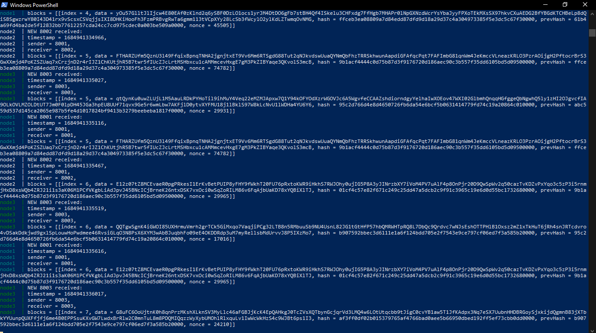

# Blockchain: Network Programming
Ilya Orlov, group 3530901/90203
## How to build and launch
Using Docker:
- Clone the repository: ```git clone https://github.com/ilyaorlov25/BlockchainJava.git```
- Build and create Docker image: ```docker build -t blockchain .```
- Launch Docker compose: ```docker-compose up```

## Demonstration
